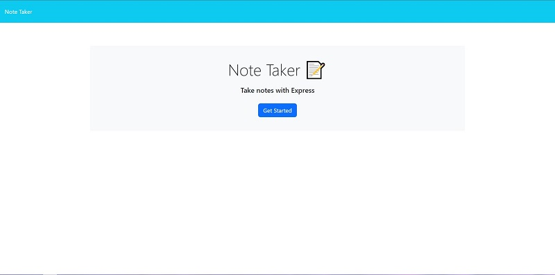
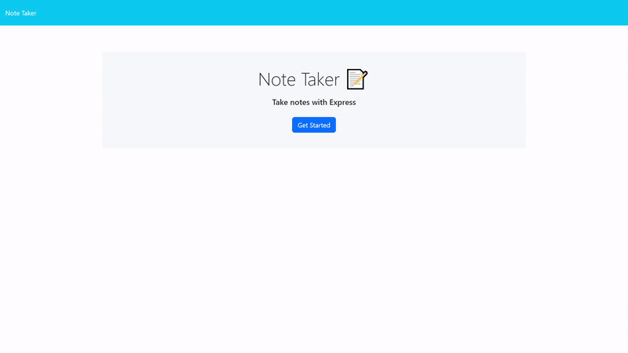
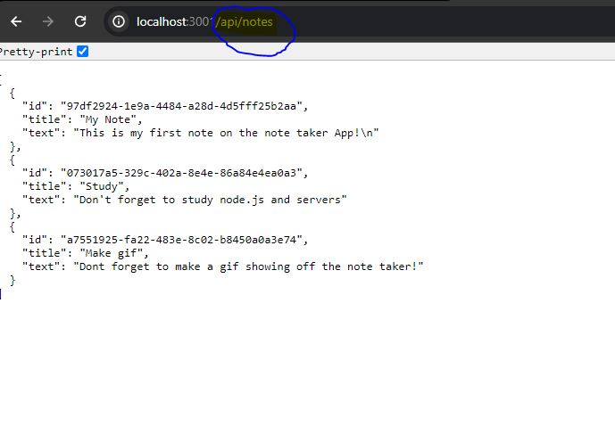

# Note Taker

 

## Description

Ever lose track of your thoughts? The Note Taker Application is the perfect solution! This application allows the user to write notes and post them to their board to review at anytime. This application uses a server so the notes persist regardless of when or how the user opens the application.

## Table of Contents (Optional)

- [Installation](#installation)
- [Usage](#usage)
- [Credits](#credits)
- [License](#license)

## Usage

Link to application: https://note-taker-1-lqdb.onrender.com

Once the user has launched the application, they are presented with The Note Taker homepage. The user must then click the "Get Started" button to begin.

The user is then brought to the main note taker page. Once the user begins to write in the note title and note text, two buttons appear in the top right to either clear the note they are filling out, or to save the note. Once the note is saved it appears in the left side panel, where the user can review it at any time by clicking on it.

 Aditionally users can access the .json database of all saved notes by going to '/api/notes' in the searchbar.

## Credits

Front-end code provided by UCI Virtual Bootcamp

Functionality gif made with ezgif.com

## License

This application is covered under Unlicense license.

## Features

This Application boasts both front-end and back-end features. Notably, the back-end runs off of server side routes that allows the user to post and save notes, as well as view api details of all saved notes.

## Questions

Any questions please reachout at: samuelfullerca@gmail.com

To view additional applications developed by myself, checkout my GitHub profile: 
<a href="https://github.com/SamuelFullerCA"> SamuelFullerCA </a>
